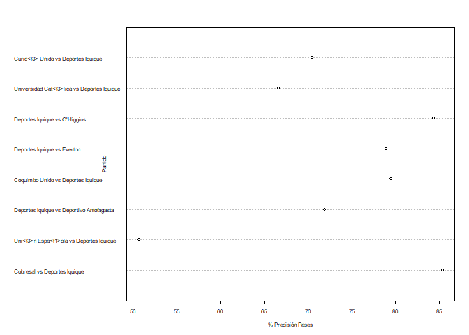
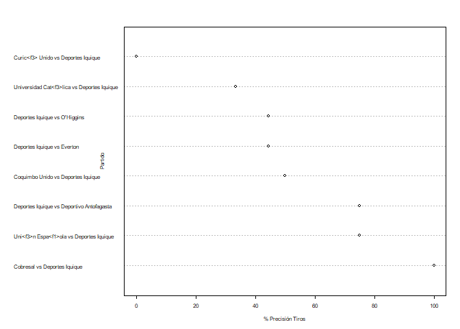
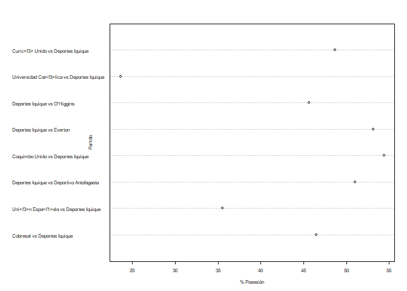

Actividad 1 - Javier Ramos
================

## Actividad Ayudantia 2

Replicar lo realizado en la ayudantia (analisis exploratorio de los
datos, limpieza, sub dataframes, filtro y graficar ), pueden elegir otro
equipo para que puedan explorar otros datos

## Analisis Exploratorio de Datos

``` r
library(quanteda)
```

    ## Package version: 3.0.0
    ## Unicode version: 10.0
    ## ICU version: 61.1

    ## Parallel computing: 8 of 8 threads used.

    ## See https://quanteda.io for tutorials and examples.

``` r
library(dplyr)
```

    ## 
    ## Attaching package: 'dplyr'

    ## The following objects are masked from 'package:stats':
    ## 
    ##     filter, lag

    ## The following objects are masked from 'package:base':
    ## 
    ##     intersect, setdiff, setequal, union

``` r
library(tidyverse)
```

    ## -- Attaching packages --------------------------------------- tidyverse 1.3.0 --

    ## v ggplot2 3.3.3     v purrr   0.3.4
    ## v tibble  3.0.3     v stringr 1.4.0
    ## v tidyr   1.1.3     v forcats 0.5.1
    ## v readr   1.4.0

    ## -- Conflicts ------------------------------------------ tidyverse_conflicts() --
    ## x dplyr::filter() masks stats::filter()
    ## x dplyr::lag()    masks stats::lag()

``` r
library(utf8)
library(ggplot2)
setwd("D:/UAI/2021 - 1/Minería de datos/Actividades/Actividad 1")
primer_tiempo2020 <- read_csv("Primer_Tiempo2020.csv", col_names = TRUE)
```

    ## 
    ## -- Column specification --------------------------------------------------------
    ## cols(
    ##   .default = col_double(),
    ##   torneo = col_character(),
    ##   equipo = col_character(),
    ##   id_partido = col_character(),
    ##   partido = col_character(),
    ##   fasepartido = col_character(),
    ##   local = col_logical(),
    ##   tiempo = col_character()
    ## )
    ## i Use `spec()` for the full column specifications.

``` r
#str(primer_tiempo2020)
#attach(primer_tiempo2020)
summary(primer_tiempo2020)
```

    ##     torneo             equipo           id_partido          partido         
    ##  Length:130         Length:130         Length:130         Length:130        
    ##  Class :character   Class :character   Class :character   Class :character  
    ##  Mode  :character   Mode  :character   Mode  :character   Mode  :character  
    ##                                                                             
    ##                                                                             
    ##                                                                             
    ##  fasepartido          local            tiempo           accuratePass  
    ##  Length:130         Mode :logical   Length:130         Min.   : 62.0  
    ##  Class :character   FALSE:65        Class :character   1st Qu.:115.2  
    ##  Mode  :character   TRUE :65        Mode  :character   Median :143.5  
    ##                                                        Mean   :147.5  
    ##                                                        3rd Qu.:181.2  
    ##                                                        Max.   :269.0  
    ##    wonTackle       lostCorners    goalsConceded        saves    
    ##  Min.   : 0.000   Min.   :0.000   Min.   :0.0000   Min.   :0.0  
    ##  1st Qu.: 3.000   1st Qu.:1.000   1st Qu.:0.0000   1st Qu.:1.0  
    ##  Median : 5.000   Median :2.000   Median :0.0000   Median :1.0  
    ##  Mean   : 5.154   Mean   :2.277   Mean   :0.5923   Mean   :1.5  
    ##  3rd Qu.: 7.000   3rd Qu.:3.000   3rd Qu.:1.0000   3rd Qu.:2.0  
    ##  Max.   :14.000   Max.   :7.000   Max.   :3.0000   Max.   :5.0  
    ##  ontargetScoringAtt totalScoringAtt     subsMade       totalThrows   
    ##  Min.   :0.000      Min.   : 0.000   Min.   :0.0000   Min.   : 3.00  
    ##  1st Qu.:1.000      1st Qu.: 4.000   1st Qu.:0.0000   1st Qu.: 8.00  
    ##  Median :2.000      Median : 6.000   Median :0.0000   Median :11.00  
    ##  Mean   :2.108      Mean   : 5.938   Mean   :0.1077   Mean   :10.98  
    ##  3rd Qu.:3.000      3rd Qu.: 7.750   3rd Qu.:0.0000   3rd Qu.:13.00  
    ##  Max.   :5.000      Max.   :14.000   Max.   :1.0000   Max.   :26.00  
    ##  totalYellowCard    goalKicks        totalPass       fkFoulWon     
    ##  Min.   :0.0000   Min.   : 0.000   Min.   : 93.0   Min.   : 2.000  
    ##  1st Qu.:0.0000   1st Qu.: 2.000   1st Qu.:159.5   1st Qu.: 5.000  
    ##  Median :1.0000   Median : 4.000   Median :189.0   Median : 6.000  
    ##  Mean   :0.9077   Mean   : 3.962   Mean   :190.9   Mean   : 6.338  
    ##  3rd Qu.:1.0000   3rd Qu.: 5.000   3rd Qu.:222.5   3rd Qu.: 8.000  
    ##  Max.   :3.0000   Max.   :11.000   Max.   :304.0   Max.   :12.000  
    ##   totalTackle       fkFoulLost     possessionPercentage totalClearance  
    ##  Min.   : 1.000   Min.   : 2.000   Min.   :23.60        Min.   : 0.000  
    ##  1st Qu.: 5.000   1st Qu.: 6.000   1st Qu.:45.62        1st Qu.: 4.000  
    ##  Median : 7.000   Median : 7.000   Median :50.00        Median : 7.000  
    ##  Mean   : 7.192   Mean   : 7.054   Mean   :50.00        Mean   : 7.385  
    ##  3rd Qu.: 9.000   3rd Qu.: 9.000   3rd Qu.:54.38        3rd Qu.:10.000  
    ##  Max.   :15.000   Max.   :13.000   Max.   :76.40        Max.   :16.000  
    ##  formationUsed blockedScoringAtt   goalAssist         goals       
    ##  Min.   :0     Min.   :0.000     Min.   :0.0000   Min.   :0.0000  
    ##  1st Qu.:0     1st Qu.:0.000     1st Qu.:0.0000   1st Qu.:0.0000  
    ##  Median :0     Median :1.000     Median :0.0000   Median :0.0000  
    ##  Mean   :0     Mean   :1.262     Mean   :0.3769   Mean   :0.5923  
    ##  3rd Qu.:0     3rd Qu.:2.000     3rd Qu.:1.0000   3rd Qu.:1.0000  
    ##  Max.   :0     Max.   :6.000     Max.   :2.0000   Max.   :3.0000  
    ##   totalOffside   shotOffTarget     wonCorners     cornerTaken   
    ##  Min.   :0.000   Min.   :0.000   Min.   :0.000   Min.   :0.000  
    ##  1st Qu.:0.000   1st Qu.:1.000   1st Qu.:1.000   1st Qu.:1.000  
    ##  Median :1.000   Median :2.000   Median :2.000   Median :2.000  
    ##  Mean   :1.038   Mean   :2.569   Mean   :2.277   Mean   :2.269  
    ##  3rd Qu.:2.000   3rd Qu.:4.000   3rd Qu.:3.000   3rd Qu.:3.000  
    ##  Max.   :5.000   Max.   :7.000   Max.   :7.000   Max.   :7.000  
    ##  penaltyConceded   penaltyFaced    penGoalsConceded   penaltyWon    
    ##  Min.   :0.0000   Min.   :0.0000   Min.   :0.0000   Min.   :0.0000  
    ##  1st Qu.:0.0000   1st Qu.:0.0000   1st Qu.:0.0000   1st Qu.:0.0000  
    ##  Median :0.0000   Median :0.0000   Median :0.0000   Median :0.0000  
    ##  Mean   :0.1692   Mean   :0.1692   Mean   :0.1308   Mean   :0.1692  
    ##  3rd Qu.:0.0000   3rd Qu.:0.0000   3rd Qu.:0.0000   3rd Qu.:0.0000  
    ##  Max.   :2.0000   Max.   :2.0000   Max.   :1.0000   Max.   :2.0000  
    ##     ownGoals        penaltySave       secondYellow      totalRedCard    
    ##  Min.   :0.00000   Min.   :0.00000   Min.   :0.00000   Min.   :0.00000  
    ##  1st Qu.:0.00000   1st Qu.:0.00000   1st Qu.:0.00000   1st Qu.:0.00000  
    ##  Median :0.00000   Median :0.00000   Median :0.00000   Median :0.00000  
    ##  Mean   :0.02308   Mean   :0.02308   Mean   :0.01538   Mean   :0.04615  
    ##  3rd Qu.:0.00000   3rd Qu.:0.00000   3rd Qu.:0.00000   3rd Qu.:0.00000  
    ##  Max.   :1.00000   Max.   :1.00000   Max.   :1.00000   Max.   :1.00000  
    ##  posesion_Rival  precision_pases precision_tiros  minutos_juego  
    ##  Min.   :23.60   Min.   :50.68   Min.   :  0.00   Min.   :10.62  
    ##  1st Qu.:45.62   1st Qu.:70.71   1st Qu.: 25.00   1st Qu.:20.53  
    ##  Median :50.00   Median :76.40   Median : 40.00   Median :22.50  
    ##  Mean   :50.00   Mean   :75.99   Mean   : 41.20   Mean   :22.50  
    ##  3rd Qu.:54.38   3rd Qu.:82.28   3rd Qu.: 57.14   3rd Qu.:24.47  
    ##  Max.   :76.40   Max.   :89.43   Max.   :100.00   Max.   :34.38  
    ##  minutos_juegorival golesSalvados   foulsInofensivos cortarJuegoContrario
    ##  Min.   :10.62      Min.   :0.000   Min.   : 1.000   Min.   : 4.00       
    ##  1st Qu.:20.53      1st Qu.:1.000   1st Qu.: 5.000   1st Qu.:10.00       
    ##  Median :22.50      Median :1.000   Median : 6.000   Median :12.00       
    ##  Mean   :22.50      Mean   :1.523   Mean   : 6.146   Mean   :12.21       
    ##  3rd Qu.:24.47      3rd Qu.:2.000   3rd Qu.: 8.000   3rd Qu.:15.00       
    ##  Max.   :34.38      Max.   :5.000   Max.   :11.000   Max.   :24.00       
    ##   juegoCortado  
    ##  Min.   : 8.00  
    ##  1st Qu.:17.00  
    ##  Median :20.00  
    ##  Mean   :20.64  
    ##  3rd Qu.:25.00  
    ##  Max.   :40.00

## Borrar Datos Char

``` r
primer_tiempo2020 <- primer_tiempo2020[,!(colnames(primer_tiempo2020) %in% c("id_partido", "fasepartido", "local", "tiempo","formationUsed", "torneo"))]
```

## Analisis descriptivo

``` r
#Ordenamiento por cantidad de goles por partido de mayor a menor
fh2020 <- primer_tiempo2020[order(primer_tiempo2020$goals, decreasing = TRUE),]
fh2020
```

    ## # A tibble: 130 x 43
    ##    equipo partido accuratePass wonTackle lostCorners goalsConceded saves
    ##    <chr>  <chr>          <dbl>     <dbl>       <dbl>         <dbl> <dbl>
    ##  1 Uni<f~ Uni<f3~          202         2           0             2     0
    ##  2 Unive~ Univer~          168         8           1             1     2
    ##  3 Unive~ Univer~          269         2           3             0     2
    ##  4 Huach~ Uni<f3~           71         4           3             3     2
    ##  5 Audax~ Uni<f3~           94         7           2             1     1
    ##  6 Santi~ Santia~          127         5           0             1     0
    ##  7 Depor~ Palest~           89         3           5             0     2
    ##  8 O'Hig~ O'Higg~          114         9           2             1     1
    ##  9 Uni<f~ O'Higg~          160         0           0             1     1
    ## 10 La Se~ La Ser~          129         1           0             0     3
    ## # ... with 120 more rows, and 36 more variables: ontargetScoringAtt <dbl>,
    ## #   totalScoringAtt <dbl>, subsMade <dbl>, totalThrows <dbl>,
    ## #   totalYellowCard <dbl>, goalKicks <dbl>, totalPass <dbl>, fkFoulWon <dbl>,
    ## #   totalTackle <dbl>, fkFoulLost <dbl>, possessionPercentage <dbl>,
    ## #   totalClearance <dbl>, blockedScoringAtt <dbl>, goalAssist <dbl>,
    ## #   goals <dbl>, totalOffside <dbl>, shotOffTarget <dbl>, wonCorners <dbl>,
    ## #   cornerTaken <dbl>, penaltyConceded <dbl>, penaltyFaced <dbl>,
    ## #   penGoalsConceded <dbl>, penaltyWon <dbl>, ownGoals <dbl>,
    ## #   penaltySave <dbl>, secondYellow <dbl>, totalRedCard <dbl>,
    ## #   posesion_Rival <dbl>, precision_pases <dbl>, precision_tiros <dbl>,
    ## #   minutos_juego <dbl>, minutos_juegorival <dbl>, golesSalvados <dbl>,
    ## #   foulsInofensivos <dbl>, cortarJuegoContrario <dbl>, juegoCortado <dbl>

``` r
#Promedio de goles
mean_goles <- mean(primer_tiempo2020$goals)
mean_goles
```

    ## [1] 0.5923077

``` r
#Des. Estadar de goles
std_dev_goles <- sd(primer_tiempo2020$goals)
std_dev_goles
```

    ## [1] 0.7334336

``` r
#Mediana de goles
median_goles <- median(primer_tiempo2020$goals)
median_goles
```

    ## [1] 0

``` r
#Maximo de goles
max_goles <- max(primer_tiempo2020$goals)
max_goles
```

    ## [1] 3

## Sub DataFrames

``` r
#Sub DF de goles
fh2020_goles = fh2020[,colnames(primer_tiempo2020) %in% c("equipo", "partido", "goals", "goalAssist")]
fh2020_goles = fh2020_goles[order(fh2020_goles$goals, decreasing = TRUE),]
fh2020_goles
```

    ## # A tibble: 130 x 4
    ##    equipo                partido                                goalAssist goals
    ##    <chr>                 <chr>                                       <dbl> <dbl>
    ##  1 Uni<f3>n Espa<f1>ola  Uni<f3>n Espa<f1>ola vs Huachipato              1     3
    ##  2 Universidad de Chile  Universidad de Chile vs Curic<f3> Uni~          2     2
    ##  3 Universidad Cat<f3>l~ Universidad Cat<f3>lica vs Deportes I~          1     2
    ##  4 Huachipato            Uni<f3>n Espa<f1>ola vs Huachipato              1     2
    ##  5 Audax Italiano        Uni<f3>n Espa<f1>ola vs Audax Italiano          2     2
    ##  6 Santiago Wanderers    Santiago Wanderers vs Audax Italiano            1     2
    ##  7 Deportivo Antofagasta Palestino vs Deportivo Antofagasta              1     2
    ##  8 O'Higgins             O'Higgins vs Universidad de Chile               2     2
    ##  9 Uni<f3>n Espa<f1>ola  O'Higgins vs Uni<f3>n Espa<f1>ola               1     2
    ## 10 La Serena             La Serena vs Santiago Wanderers                 2     2
    ## # ... with 120 more rows

``` r
#Sub DF de estadisticas generales
fh2020_estadis = fh2020[,colnames(primer_tiempo2020) %in% c("equipo", "partido", "possessionPercentage", "precision_pases", "precision_tiros")]
fh2020_estadis = fh2020_estadis[order(fh2020_estadis$precision_tiros, decreasing = TRUE),]
fh2020_estadis
```

    ## # A tibble: 130 x 5
    ##    equipo      partido          possessionPerce~ precision_pases precision_tiros
    ##    <chr>       <chr>                       <dbl>           <dbl>           <dbl>
    ##  1 Huachipato  Uni<f3>n Espa<f~             32.2            67.6           100  
    ##  2 Universida~ Uni<f3>n La Cal~             52.3            82.7           100  
    ##  3 Audax Ital~ Santiago Wander~             43.1            65             100  
    ##  4 O'Higgins   O'Higgins vs Sa~             44.1            66.2           100  
    ##  5 Deportes I~ Cobresal vs Dep~             46.5            85.4           100  
    ##  6 Uni<f3>n E~ Uni<f3>n Espa<f~             67.8            85.2            87.5
    ##  7 O'Higgins   O'Higgins vs Un~             48.2            69.5            85.7
    ##  8 Uni<f3>n E~ O'Higgins vs Un~             61.3            76.9            83.3
    ##  9 Universida~ Universidad Cat~             50.5            80              83.3
    ## 10 Universida~ Santiago Wander~             49.3            68.8            83.3
    ## # ... with 120 more rows

## Filtrar Datos

``` r
d_iqq <- filter(primer_tiempo2020, equipo == "Deportes Iquique")
iqq_goles <- filter(fh2020_goles, equipo == "Deportes Iquique")
iqq_estadis <- filter(fh2020_estadis, equipo == "Deportes Iquique")
```

## Agregar Promedio/Suma Total/Min/…

``` r
#Calculo promedio de goles
iqq_goles <- iqq_goles[,!(colnames(iqq_goles) %in% c("equipo"))] 
Promedios_goles <- c("Promedio Goles",mean(iqq_goles$goals),mean(iqq_goles$goalAssist))
iqq_goles <- rbind(iqq_goles, Promedios_goles)

#Calculo maximo de goles
Max_goles <- c("Max Goles",max(iqq_goles$goals),max(iqq_goles$goalAssist))
iqq_goles <- rbind(iqq_goles, Max_goles)

#Calculo minimo de goles
Min_goles <- c("Min Pases",min(iqq_goles$goals),min(iqq_goles$goalAssist))
iqq_goles <- rbind(iqq_goles, Min_goles)
iqq_goles
```

    ## # A tibble: 11 x 3
    ##    partido                                     goalAssist goals
    ##    <chr>                                       <chr>      <chr>
    ##  1 Deportes Iquique vs Everton                 1          2    
    ##  2 Uni<f3>n Espa<f1>ola vs Deportes Iquique    1          1    
    ##  3 Deportes Iquique vs O'Higgins               0          1    
    ##  4 Coquimbo Unido vs Deportes Iquique          1          1    
    ##  5 Cobresal vs Deportes Iquique                1          1    
    ##  6 Universidad Cat<f3>lica vs Deportes Iquique 0          0    
    ##  7 Deportes Iquique vs Deportivo Antofagasta   0          0    
    ##  8 Curic<f3> Unido vs Deportes Iquique         0          0    
    ##  9 Promedio Goles                              0.75       0.5  
    ## 10 Max Goles                                   2          1    
    ## 11 Min Pases                                   0          0

## Graficos

``` r
#Gráficos
dotchart(iqq_estadis$precision_pases, labels = utf8_encode(iqq_estadis$partido), cex=0.5, xlab = "% Precisión Pases", ylab = "Partido")
```

<!-- -->

``` r
dotchart(iqq_estadis$precision_tiros, labels = utf8_encode(iqq_estadis$partido), cex=0.5, xlab = "% Precisión Tiros", ylab = "Partido")
```

<!-- -->

``` r
dotchart(iqq_estadis$possessionPercentage, labels = utf8_encode(iqq_estadis$partido), cex=0.5, xlab = "% Posesión", ylab = "Partido")
```

<!-- -->
