Actividad Ayudantía 5 - Javier Ramos
================

# K-Medias

Para el análisis de clusters vamos a analizar la data de
“sanguchez.csv”. Luego se tiene:

``` r
library(tidyverse)
```

    ## -- Attaching packages --------------------------------------- tidyverse 1.3.1 --

    ## v ggplot2 3.3.3     v purrr   0.3.4
    ## v tibble  3.1.0     v dplyr   1.0.5
    ## v tidyr   1.1.3     v stringr 1.4.0
    ## v readr   1.4.0     v forcats 0.5.1

    ## -- Conflicts ------------------------------------------ tidyverse_conflicts() --
    ## x dplyr::filter() masks stats::filter()
    ## x dplyr::lag()    masks stats::lag()

``` r
library(dplyr)
```

``` r
setwd("D:/UAI/Minería de datos/Actividades/Actividad Ayudantía 5")
sanguchez <- read.csv("sanguchez.csv", header = TRUE, sep = ";")
```

Para clusterizar se usarán las columnas de precio y nota. Para analizar
el comportamiento se excluirán el resto de variables.

Antes de clusterizar debemos preparar la data:

-   Eliminando datos faltantes.

-   Limpiar variable de precio.

-   Eliminar datos atípicos

-   Escalar la data

### Eliminando datos faltantes

``` r
sanguchez <- sanguchez[,!(colnames(sanguchez) %in% c("url", "Local", "Direccion","Ingredientes", "texto"))]
sanguchez <- na.omit(sanguchez)
sanguchez_aux <- sanguchez
```

### Limpiar variable precio

``` r
sanguchez_aux$Precio = gsub("[a-zA-Z]", "", sanguchez_aux$Precio)
sanguchez_aux$Precio = gsub("\\$", "", sanguchez_aux$Precio)
sanguchez_aux$Precio = gsub("\\.", "", sanguchez_aux$Precio)
sanguchez_aux$Precio = gsub(" ", "", sanguchez_aux$Precio)

sanguchez_aux <- transform(sanguchez_aux, Precio = as.numeric(Precio))
```

    ## Warning in eval(substitute(list(...)), `_data`, parent.frame()): NAs
    ## introducidos por coerción

``` r
sanguchez_aux <- transform(sanguchez_aux, nota = as.numeric(nota))
sanguchez_aux <- na.omit(sanguchez_aux)
summary(sanguchez_aux)
```

    ##      Precio              nota      
    ##  Min.   :       7   Min.   :1.000  
    ##  1st Qu.:    4460   1st Qu.:3.000  
    ##  Median :    5900   Median :3.000  
    ##  Mean   :   94179   Mean   :3.175  
    ##  3rd Qu.:    6990   3rd Qu.:4.000  
    ##  Max.   :35005500   Max.   :5.000

### Eliminar valores atípicos: Variable Precio

``` r
hist(sanguchez_aux$Precio)
```

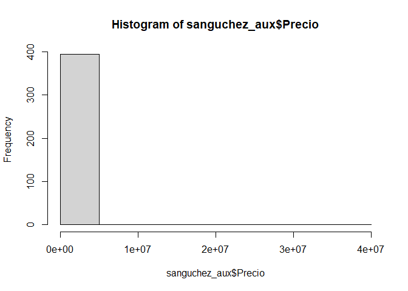<!-- -->

``` r
boxplot(sanguchez_aux$Precio, horizontal = TRUE)
```

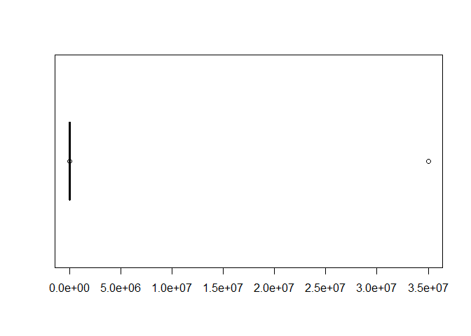<!-- -->

``` r
plot(sanguchez_aux)
```

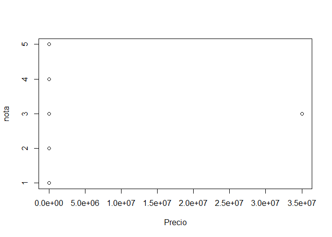<!-- -->

``` r
#boxplot.stats(sanguchez_aux$Precio)

attach(sanguchez_aux)
aux <- Precio[Precio < 35005500]
##boxplot(aux, horizontal = TRUE)
##boxplot.stats(aux)

aux <- Precio[Precio < 14600]
#boxplot(aux, horizontal = TRUE)
#boxplot.stats(aux)

aux <- Precio[Precio < 12900]
#boxplot(aux, horizontal = TRUE)
#boxplot.stats(aux)

aux <- Precio[Precio < 10800]
#boxplot(aux, horizontal = TRUE)
#boxplot.stats(aux)

aux <- Precio[Precio < 10700]
#boxplot(aux, horizontal = TRUE)
#boxplot.stats(aux)

aux <- Precio[Precio > 600 & Precio < 10700]
#boxplot(aux, horizontal = TRUE)
#boxplot.stats(aux)+

aux <- Precio[Precio > 1550 & Precio < 10500]
#boxplot(aux, horizontal = TRUE)
#boxplot.stats(aux)

aux <- Precio[Precio > 1650 & Precio < 10500]
#boxplot(aux, horizontal = TRUE)
#boxplot.stats(aux)

aux <- Precio[Precio > 1700 & Precio < 10500]
boxplot(aux, horizontal = TRUE)
```

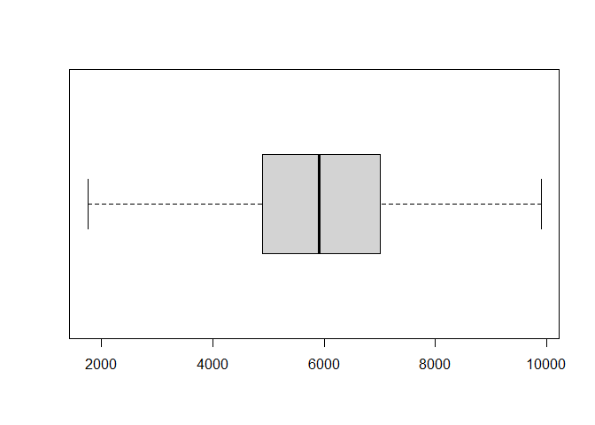<!-- -->

``` r
boxplot.stats(aux)
```

    ## $stats
    ## [1] 1750 4890 5915 7000 9900
    ## 
    ## $n
    ## [1] 350
    ## 
    ## $conf
    ## [1] 5736.801 6093.199
    ## 
    ## $out
    ## numeric(0)

``` r
hist(aux)
```

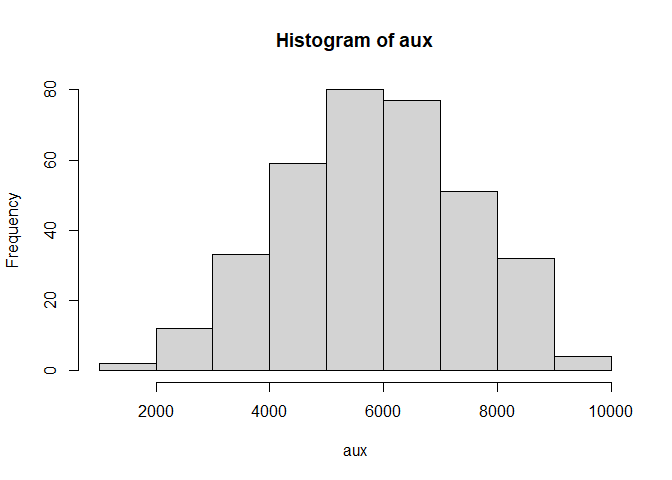<!-- -->

``` r
plot(aux)
```

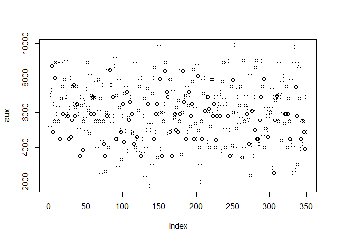<!-- -->

### Eliminar valores atípicos: Variable Nota

``` r
hist(sanguchez_aux$nota)
```

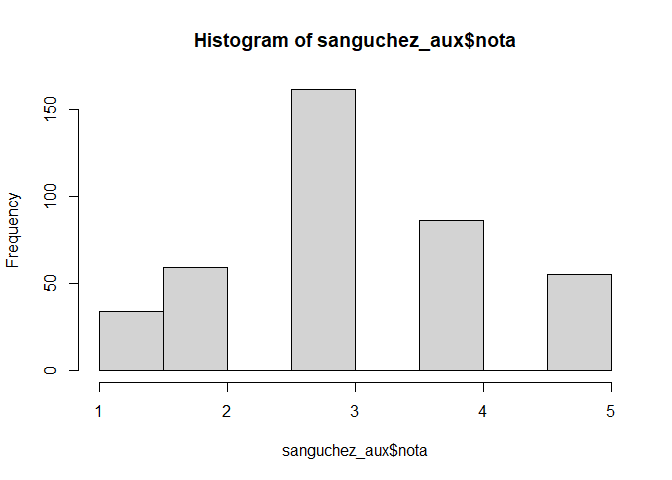<!-- -->

``` r
boxplot(sanguchez_aux$nota, horizontal = TRUE)
```

<!-- -->

``` r
plot(sanguchez_aux)
```

<!-- -->

``` r
#boxplot.stats(sanguchez_aux$nota)

attach(sanguchez_aux)
```

    ## The following objects are masked from sanguchez_aux (pos = 3):
    ## 
    ##     nota, Precio

``` r
aux2 <- nota[nota > 1]
boxplot(aux2, horizontal = TRUE)
```

<!-- -->

``` r
boxplot.stats(aux2)
```

    ## $stats
    ## [1] 2 3 3 4 5
    ## 
    ## $n
    ## [1] 361
    ## 
    ## $conf
    ## [1] 2.916842 3.083158
    ## 
    ## $out
    ## numeric(0)

``` r
hist(aux2)
```

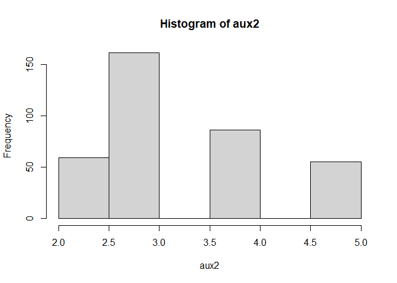<!-- -->

``` r
plot(aux2)
```

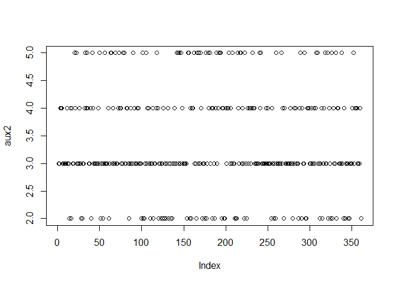<!-- -->

### Escalar la data

Primero se filtará según los datos obtenidos en el ítem anterios y luego
se hará la escala

``` r
sanguchez_aux2 <- filter(sanguchez_aux, Precio > 1700, Precio < 10500, nota > 1)

#Se crea esta nueva varibale para después usarla en el segundo análisis del cluster
sanguchez_aux3 <- sanguchez_aux2

escal_data = scale(sanguchez_aux2) %>% as_tibble()
escal_data %>% summary()
```

    ##      Precio              nota        
    ##  Min.   :-2.60373   Min.   :-1.4676  
    ##  1st Qu.:-0.66984   1st Qu.:-0.3880  
    ##  Median :-0.05388   Median :-0.3880  
    ##  Mean   : 0.00000   Mean   : 0.0000  
    ##  3rd Qu.: 0.61584   3rd Qu.: 0.6916  
    ##  Max.   : 2.40381   Max.   : 1.7713

``` r
plot(sanguchez_aux2)
```

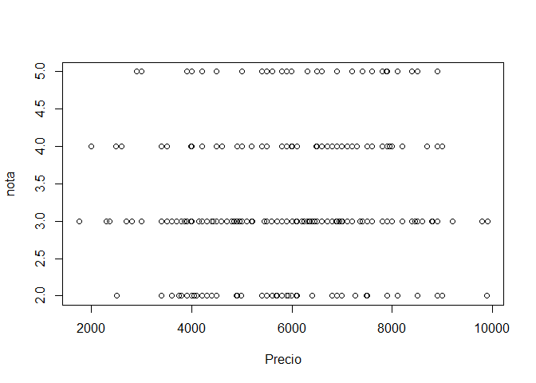<!-- -->

Ahora que está escalada la data, vamos a aplicar el algoritmo de
kmedias, que viene implementado en R base. Para probar, vamos a aplicar
kmedias = 10

### Análisis Cluster K = 7

``` r
modelo_kmeans <- kmeans(escal_data, centers = 7)
modelo_kmeans2 <- kmeans(sanguchez_aux2, centers = 7)

# creo la variable cluster en la tabla escal_data
escal_data$clus <- modelo_kmeans$cluster %>% as.factor()
sanguchez_aux2$clus <- modelo_kmeans2$cluster %>% as.factor()

ggplot(escal_data, aes(nota, Precio, color=clus)) +
  geom_point(alpha=0.5, show.legend = T) +
  theme_bw()
```

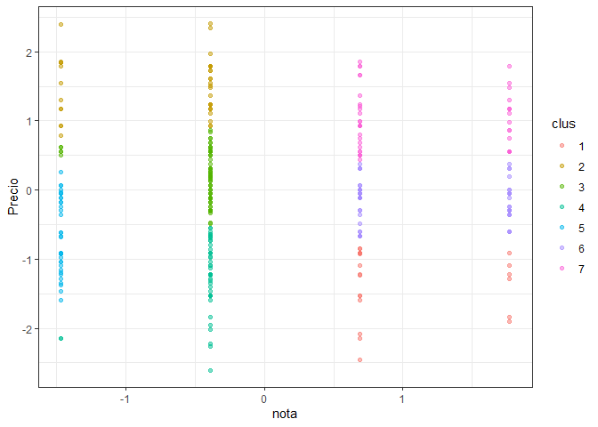<!-- -->

``` r
ggplot(sanguchez_aux2, aes(nota, Precio, color=clus)) +
  geom_point(alpha=0.5, show.legend = T) +
  theme_bw()
```

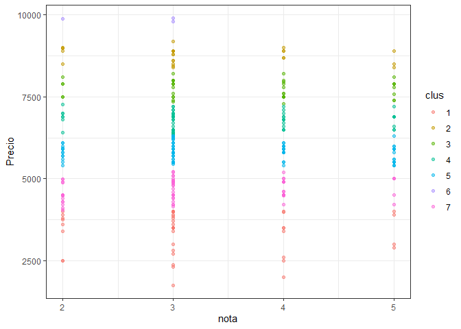<!-- -->

``` r
info_clus <- modelo_kmeans$centers
info_clus2 <- modelo_kmeans2$centers
info_clus
```

    ##       Precio       nota
    ## 1 -1.3366225  0.9860946
    ## 2  1.4924181 -0.7201947
    ## 3  0.2028410 -0.4572047
    ## 4 -1.2359993 -0.4329819
    ## 5 -0.6547456 -1.4676400
    ## 6 -0.1598359  1.1601708
    ## 7  0.9878352  1.1141155

``` r
info_clus2
```

    ##     Precio     nota
    ## 1 3380.930 3.186047
    ## 2 8777.308 3.230769
    ## 3 7743.500 3.600000
    ## 4 6794.677 3.435484
    ## 5 5824.943 3.459770
    ## 6 9863.333 2.666667
    ## 7 4662.712 3.186441

### Evolución suma de cuadrados intra-cluster en la medida que aumentamos el numero de k

``` r
SSinterior <- numeric(30)
for(k in 1:30){
  modelo <- kmeans(escal_data, centers = k)
  SSinterior[k] <- modelo$tot.withinss
}
plot(SSinterior)
```

<!-- -->

### Metodo del Codo 2

``` r
#Calculando K para Data normalizada
k.max <- 30
wss1 <- sapply(1:k.max, 
              function(k){kmeans(escal_data, k, nstart=50,iter.max = 8)$tot.withinss})
wss2 <- sapply(1:k.max, 
              function(k){kmeans(sanguchez_aux2, k, nstart=50,iter.max = 8)$tot.withinss})
#wss1
plot(1:k.max, wss1,
     type="b", pch = 19, frame = FALSE, 
     xlab="Numeros de clusters K",
     ylab="Total within-clusters sum of squares")
```

<!-- -->

``` r
plot(1:k.max, wss2,
     type="b", pch = 19, frame = FALSE, 
     xlab="Numeros de clusters K",
     ylab="Total within-clusters sum of squares")
```

<!-- -->

## Evaluacion

Existen diversos metodos de evaluacion de calidad de los clusters
resultantes.

### Inspeccion visual

``` r
escal_data$clus <- as.numeric(escal_data$clus)
sanguchez_aux2$clus <- as.numeric(sanguchez_aux2$clus)

# uso distancia euclidiana
tempDist <- dist(escal_data) %>% as.matrix()

#reordeno filas y columnas en base al cluster obtenido
index <- sort(modelo_kmeans$cluster, index.return=TRUE)
tempDist <- tempDist[index$ix,index$ix]
rownames(tempDist) <- c(1:nrow(escal_data))
colnames(tempDist) <- c(1:nrow(escal_data))
image(tempDist)
```

<!-- -->

### Estadistico de Hopkins

``` r
library(factoextra)
```

    ## Welcome! Want to learn more? See two factoextra-related books at https://goo.gl/ve3WBa

``` r
#Calcula el hopkins statistic 
res <- get_clust_tendency(escal_data, n = 30, graph = FALSE)
res2 <- get_clust_tendency(sanguchez_aux2, n = 30, graph = FALSE)
print(res)
```

    ## $hopkins_stat
    ## [1] 0.9461718
    ## 
    ## $plot
    ## NULL

``` r
print(res2)
```

    ## $hopkins_stat
    ## [1] 0.6826864
    ## 
    ## $plot
    ## NULL

### Indice de correlación

``` r
#Correlation
#construyo matriz de correlacion ideal (cada entidad correlaciona 1 con su cluster)
tempMatrix <- matrix(0, nrow = nrow(sanguchez_aux2), ncol = nrow(sanguchez_aux2))
tempMatrix[which(index$x==1), which(index$x==1)]  <- 1
tempMatrix[which(index$x==2), which(index$x==2)]  <- 1
tempMatrix[which(index$x==3), which(index$x==3)]  <- 1
tempMatrix[which(index$x==4), which(index$x==4)]  <- 1
tempMatrix[which(index$x==5), which(index$x==5)]  <- 1
tempMatrix[which(index$x==6), which(index$x==6)]  <- 1
tempMatrix[which(index$x==7), which(index$x==7)]  <- 1

#construyo matriz de disimilitud
tempDist2 <- 1/(1+tempDist)

#Calcula correlacion 
cor <- cor(tempMatrix[upper.tri(tempMatrix)],tempDist2[upper.tri(tempDist2)])
print(cor)
```

    ## [1] 0.8151443

### Indice de cohesión y el de separación.

``` r
library(flexclust) # usaremos la distancia implementada en flexclus (dist2) que maneja mejor objetos de diferente tamaño
```

    ## Loading required package: grid

    ## Loading required package: lattice

    ## Loading required package: modeltools

    ## Loading required package: stats4

``` r
#escal_data_pok <- apply(escal_data_pok,2,as.numeric)
 
#Cohesion
withinCluster <- numeric(7)
for (i in 1:7){
  tempdata <- escal_data[which(modelo_kmeans$cluster == i),]
  withinCluster[i] <- sum(dist2(tempdata,colMeans(tempdata))^2)
}
cohesion = sum(withinCluster)
#es equivalente a model$tot.withinss en k-means
print(c(cohesion, modelo_kmeans$tot.withinss))
```

    ## [1] 105.8799 105.8799

``` r
#Separation
meandata <- colMeans(escal_data)
SSB <- numeric(7)
for (i in 1:7){
  tempdata <- escal_data[which(modelo_kmeans$cluster==i),]
  SSB[i] <- nrow(tempdata)*sum((meandata-colMeans(tempdata))^2)
}
separation = sum(SSB)
print(separation)
```

    ## [1] 1614.32

### Coeficiente de silueta

``` r
library(cluster)
coefSil <- silhouette(modelo_kmeans$cluster,dist(escal_data))
summary(coefSil)
```

    ## Silhouette of 320 units in 7 clusters from silhouette.default(x = modelo_kmeans$cluster, dist = dist(escal_data)) :
    ##  Cluster sizes and average silhouette widths:
    ##        22        39        78        48        34        53        46 
    ## 0.7216933 0.5470319 0.6773348 0.6259745 0.6337931 0.5627048 0.5085487 
    ## Individual silhouette widths:
    ##    Min. 1st Qu.  Median    Mean 3rd Qu.    Max. 
    ##  0.1966  0.5466  0.6126  0.6089  0.6955  0.7998

``` r
#visualizamos el codigo de silueta de cada cluster
fviz_silhouette(coefSil) + coord_flip()
```

    ##   cluster size ave.sil.width
    ## 1       1   22          0.72
    ## 2       2   39          0.55
    ## 3       3   78          0.68
    ## 4       4   48          0.63
    ## 5       5   34          0.63
    ## 6       6   53          0.56
    ## 7       7   46          0.51

<!-- -->

### Utilizamos el coeficiente de silueta para encontrar el mejor valor de K

``` r
coefSil=numeric(30)
for (k in 2:30){
  modelo <- kmeans(escal_data, centers = k)
  temp <- silhouette(modelo$cluster,dist(escal_data ))
  coefSil[k] <- mean(temp[,3])
}
tempDF=data.frame(CS=coefSil,K=c(1:30))
ggplot(tempDF, aes(x=K, y=CS)) + 
  geom_line() +
  scale_x_continuous(breaks=c(1:30))
```

<!-- -->

# 2do Análisis Cluster

Importante: Notar que al correr el programa el K óptimo varía entre 13 y
15, pero para terminos de esta evaluación se usará k = 15

``` r
escal_data2 = scale(sanguchez_aux3) %>% as_tibble()
modelo_kmean <- kmeans(escal_data2, centers = 15)
modelo_kmean2 <- kmeans(sanguchez_aux3, centers = 15)
# creo la variable cluster en la tabla escal_data_pokda
escal_data2$clus2 <- modelo_kmean$cluster %>% as.factor()
sanguchez_aux3$clus2 <- modelo_kmean2$cluster %>% as.factor()
ggplot(escal_data2, aes(nota, Precio, color=clus2)) +
  geom_point(alpha=0.5, show.legend = T) +
  theme_bw()
```

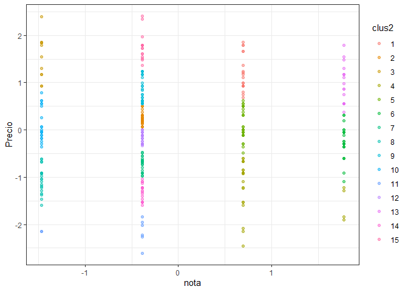<!-- -->

``` r
ggplot(sanguchez_aux3, aes(nota, Precio, color=clus2)) +
  geom_point(alpha=0.5, show.legend = T) +
  theme_bw()
```

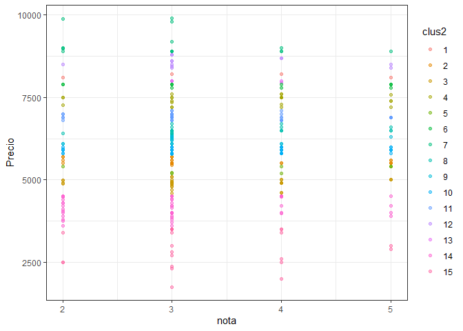<!-- -->

``` r
info_clusters <- modelo_kmean$centers
info_clusters2 <- modelo_kmean2$centers
info_clusters
```

    ##        Precio       nota
    ## 1   1.1847975  0.6916464
    ## 2   0.2517409 -0.3879968
    ## 3   1.5246287 -1.4676400
    ## 4  -1.2030824  0.8577454
    ## 5   0.1029925  0.6916464
    ## 6  -0.2540763  1.7712896
    ## 7  -0.7309116 -0.3879968
    ## 8  -1.0507767 -1.4676400
    ## 9   0.8243225 -0.3879968
    ## 10  0.1193899 -1.4676400
    ## 11 -2.1498239 -0.6579076
    ## 12 -0.1670725 -0.3879968
    ## 13  0.9447202  1.7712896
    ## 14 -1.3210492 -0.3879968
    ## 15  1.7640438 -0.3879968

``` r
info_clusters2
```

    ##      Precio     nota
    ## 1  8150.000 3.500000
    ## 2  5556.400 3.400000
    ## 3  4896.429 3.357143
    ## 4  7425.217 3.608696
    ## 5  5326.250 3.875000
    ## 6  7874.167 3.666667
    ## 7  9110.000 3.000000
    ## 8  6512.632 3.526316
    ## 9  6214.211 3.105263
    ## 10 5887.000 3.550000
    ## 11 6910.556 3.416667
    ## 12 8577.500 3.416667
    ## 13 7988.333 3.333333
    ## 14 4170.208 3.020833
    ## 15 2939.130 3.304348

## Evaluacion

### Inspeccion visual

``` r
escal_data2$clus <- as.numeric(escal_data2$clus2)
sanguchez_aux3$clus <- as.numeric(sanguchez_aux3$clus2)
# uso distancia euclidiana
tempDist_2 <- dist(escal_data2) %>% as.matrix()
#reordeno filas y columnas en base al cluster obtenido
index <- sort(modelo_kmean$cluster, index.return=TRUE)
tempDist_2 <- tempDist_2[index$ix,index$ix]
rownames(tempDist_2) <- c(1:nrow(escal_data))
colnames(tempDist_2) <- c(1:nrow(escal_data))
image(tempDist_2)
```

<!-- -->

### Estadistico de Hopkins.

``` r
library(factoextra)
escal_data2$clus2 <- NULL
sanguchez_aux3$clus2 <- NULL
#Calcula el hopkins statistic 
res_1 <- get_clust_tendency(escal_data2, n = 30, graph = FALSE)
res_2 <- get_clust_tendency(sanguchez_aux3, n = 30, graph = FALSE)
print(res_1)
```

    ## $hopkins_stat
    ## [1] 0.9530307
    ## 
    ## $plot
    ## NULL

``` r
print(res_2)
```

    ## $hopkins_stat
    ## [1] 0.6873442
    ## 
    ## $plot
    ## NULL

### Indice de correlación

``` r
#Correlation
#construyo matriz de correlacion ideal (cada entidad correlaciona 1 con su cluster)
tempMatrix2 <- matrix(0, nrow = nrow(escal_data2), ncol = nrow(escal_data2))
tempMatrix[which(index$x==1), which(index$x==1)]  <- 1
tempMatrix[which(index$x==2), which(index$x==2)]  <- 1
tempMatrix[which(index$x==3), which(index$x==3)]  <- 1
tempMatrix[which(index$x==4), which(index$x==4)]  <- 1
tempMatrix[which(index$x==5), which(index$x==5)]  <- 1
tempMatrix[which(index$x==6), which(index$x==6)]  <- 1
tempMatrix[which(index$x==7), which(index$x==7)]  <- 1
tempMatrix[which(index$x==8), which(index$x==8)]  <- 1
tempMatrix[which(index$x==9), which(index$x==9)]  <- 1
tempMatrix[which(index$x==10), which(index$x==10)] <- 1
tempMatrix[which(index$x==11), which(index$x==11)] <- 1
tempMatrix[which(index$x==12), which(index$x==12)] <- 1
tempMatrix[which(index$x==13), which(index$x==13)] <- 1
tempMatrix[which(index$x==14), which(index$x==14)] <- 1
tempMatrix[which(index$x==15), which(index$x==15)] <- 1

#construyo matriz de disimilitud
tempDist_22 <- 1/(1+tempDist_2)
#Calcula correlacion 
cor2 <- cor(tempMatrix2[upper.tri(tempMatrix2)],tempDist_2[upper.tri(tempDist_2)])
```

    ## Warning in cor(tempMatrix2[upper.tri(tempMatrix2)],
    ## tempDist_2[upper.tri(tempDist_2)]): the standard deviation is zero

``` r
print(cor2)
```

    ## [1] NA

### Indice de cohesión y el de separación.

``` r
library(flexclust) # usaremos la distancia implementada en flexclus (dist2) que maneja mejor objetos de diferente tamaño
escal_data2 <- apply(escal_data2,2,as.numeric)
 
#Cohesion
withinCluster <- numeric(15)
for (i in 1:15){
  tempdata2 <- escal_data2[which(modelo_kmean$cluster == i),]
  withinCluster[i] <- sum(dist2(tempdata2,colMeans(tempdata2))^2)
}
cohesion2 = sum(withinCluster)
#es equivalente a model$tot.withinss en k-means
print(c(cohesion2, modelo_kmean$tot.withinss))
```

    ## [1] 35.42929 35.42929

``` r
#Separation
meandata2 <- colMeans(escal_data2)
SSB <- numeric(15)
for (i in 1:15){
  tempdata2 <- escal_data2[which(modelo_kmean$cluster==i),]
  SSB[i] <- nrow(tempdata2)*sum((meandata2-colMeans(tempdata2))^2)
}
separation2 = sum(SSB)
print(separation2)
```

    ## [1] 6233.771

### Coeficiente de silueta

``` r
library(cluster)
coefSil2 <- silhouette(modelo_kmean$cluster,dist(escal_data2))
summary(coefSil2)
```

    ## Silhouette of 320 units in 15 clusters from silhouette.default(x = modelo_kmean$cluster, dist = dist(escal_data2)) :
    ##  Cluster sizes and average silhouette widths:
    ##        20        27        11        26        32        24        21        20 
    ## 0.7636812 0.9183144 0.7224448 0.5579282 0.7752974 0.7593099 0.8792801 0.7861570 
    ##        29        20         8        26        19        21        16 
    ## 0.8233938 0.7543796 0.7167501 0.9418554 0.8255664 0.9141035 0.9015378 
    ## Individual silhouette widths:
    ##    Min. 1st Qu.  Median    Mean 3rd Qu.    Max. 
    ##  0.4396  0.7636  0.8267  0.8070  0.9027  0.9557

``` r
#visualizamos el codigo de silueta de cada cluster
fviz_silhouette(coefSil2) + coord_flip()
```

    ##    cluster size ave.sil.width
    ## 1        1   20          0.76
    ## 2        2   27          0.92
    ## 3        3   11          0.72
    ## 4        4   26          0.56
    ## 5        5   32          0.78
    ## 6        6   24          0.76
    ## 7        7   21          0.88
    ## 8        8   20          0.79
    ## 9        9   29          0.82
    ## 10      10   20          0.75
    ## 11      11    8          0.72
    ## 12      12   26          0.94
    ## 13      13   19          0.83
    ## 14      14   21          0.91
    ## 15      15   16          0.90

<!-- -->
