Actividad Ayudantía 8 - Javier Ramos
================

# Creación de Playlist Spotify

## 1. Carga de data

### 1.1 Librerias

``` r
library(quanteda)
```

    ## Package version: 3.0.0
    ## Unicode version: 10.0
    ## ICU version: 61.1

    ## Parallel computing: 8 of 8 threads used.

    ## See https://quanteda.io for tutorials and examples.

``` r
library(dplyr)
```

    ## 
    ## Attaching package: 'dplyr'

    ## The following objects are masked from 'package:stats':
    ## 
    ##     filter, lag

    ## The following objects are masked from 'package:base':
    ## 
    ##     intersect, setdiff, setequal, union

``` r
library(tidyverse)
```

    ## -- Attaching packages --------------------------------------- tidyverse 1.3.0 --

    ## v ggplot2 3.3.3     v purrr   0.3.4
    ## v tibble  3.0.3     v stringr 1.4.0
    ## v tidyr   1.1.3     v forcats 0.5.1
    ## v readr   1.4.0

    ## -- Conflicts ------------------------------------------ tidyverse_conflicts() --
    ## x dplyr::filter() masks stats::filter()
    ## x dplyr::lag()    masks stats::lag()

``` r
library(utf8)
library(cluster)
library(mclust)
```

    ## Package 'mclust' version 5.4.7
    ## Type 'citation("mclust")' for citing this R package in publications.

    ## 
    ## Attaching package: 'mclust'

    ## The following object is masked from 'package:purrr':
    ## 
    ##     map

``` r
library(e1071)
```

### 1.2 Base de datos

``` r
load("D:/UAI/2021 - 1/Minería de datos/Actividades/Actividad Ayudantía 8/beats.RData")
```

## 2. Preprocesamiento de datos

### 2.1 Eliminar data

Se procederá a eliminar aquellos datos que no se utilizarán en el
análisis

``` r
beats <- beats[,!(colnames(beats) %in% c("artist_id", "album_id", "album_type","album_release_date", "album_release_date_precision", "analysis_url", "disc_number", "explicit", "track_href", "is_local", "track_preview_url", "track_number", "type", "track_uri", "external_urls.spotify", "album_name", "key_mode", "mode_name", "key_name", "time_signature", "album_release_year"))]
```

### 2.2 Eliminar datos vacíos

Se procederá a eliminar aquellas entidades que contengan atributos
vacíos

``` r
beats[beats == ""] <- NA
beats <- na.omit(beats)
```

## 2.3 Eliminar datos duplicados

Se eliminarán aquellas canciones que estén duplicadas

``` r
beats <- beats[!duplicated(beats$track_id),]
```

### 2.4 Revisar estructura de los datos

Se transformará cada variable a su tipo correspondiente

``` r
beats$track_id <- as.character(beats$track_id)
beats$track_name <- as.character(beats$track_name)
beats$artist_name <- as.character(beats$artist_name)

beats$danceability <- as.double(as.character(beats$danceability))
beats$energy <- as.double(as.character(beats$energy))
beats$key <- as.double(as.character(beats$key))
beats$loudness <- as.double(as.character(beats$loudness))
beats$mode <- as.double(as.character(beats$mode))
beats$speechiness <- as.double(as.character(beats$speechiness)) 
beats$acousticness <- as.double(as.character(beats$acousticness))
beats$instrumentalness <- as.double(as.character(beats$instrumentalness))
beats$liveness <- as.double(as.character(beats$liveness))
beats$valence <- as.double(as.character(beats$valence))
beats$tempo <- as.double(as.character(beats$tempo))
beats$duration_ms <- as.double(as.character(beats$duration_ms))
```

### 2.5 Selección aleatoria

Se seleccionarán datos de forma aleatoria para poder ocupar menos
recursos computacionales

``` r
set.seed(500)

spBeats <- beats[sample(nrow(beats), 8000),]
```

### 2.6 Separar datos

Se separarán los datos para trabajar con variables de una misma
“familia”, esto es, de un mismo tipo

``` r
dt_char <- c("track_id", "track_name", "artist_name")

dt_num <-c("key", "danceability", "energy", "loudness", "mode", "speechiness","acousticness","instrumentalness", "liveness", "valence", "tempo", "duration_ms")

data_num <- spBeats %>% 
  select(dt_num)
```

    ## Note: Using an external vector in selections is ambiguous.
    ## i Use `all_of(dt_num)` instead of `dt_num` to silence this message.
    ## i See <https://tidyselect.r-lib.org/reference/faq-external-vector.html>.
    ## This message is displayed once per session.

``` r
data_char <- spBeats %>% 
  select(dt_char)
```

    ## Note: Using an external vector in selections is ambiguous.
    ## i Use `all_of(dt_char)` instead of `dt_char` to silence this message.
    ## i See <https://tidyselect.r-lib.org/reference/faq-external-vector.html>.
    ## This message is displayed once per session.

### 2.7 Escalar datos

Se procede a realizar el escalamiento de datos para su posterior
análisis

``` r
escal_data <- sapply(data_num, scale) %>% as.data.frame()
```

## 3. Procesamiento de datos

### 3.1 Análisis de claustering: DBSCAN

Ahora que está escalada la data, se aplicará el algoritmo de DBSCAN.

``` r
library(dbscan)

set.seed(369)

model = dbscan(escal_data, eps = 1, minPts = 6)

model
```

    ## DBSCAN clustering for 8000 objects.
    ## Parameters: eps = 1, minPts = 6
    ## The clustering contains 79 cluster(s) and 4038 noise points.
    ## 
    ##    0    1    2    3    4    5    6    7    8    9   10   11   12   13   14   15 
    ## 4038  642 2359   15  297    7    6   10   55   10    6    9    8    6   26   16 
    ##   16   17   18   19   20   21   22   23   24   25   26   27   28   29   30   31 
    ##    6    6    7    5    6   17    6    9   12    6    6    6    8    8    8   11 
    ##   32   33   34   35   36   37   38   39   40   41   42   43   44   45   46   47 
    ##    7    8    6    9   12   11    9    8    7    6    7    7    6    7    6    6 
    ##   48   49   50   51   52   53   54   55   56   57   58   59   60   61   62   63 
    ##    9    7   10    6   17    7    9    6    7    7    7    8    8   10    6    8 
    ##   64   65   66   67   68   69   70   71   72   73   74   75   76   77   78   79 
    ##    6    9   11    6    5    6    6    6    8    7    7    6    8    7    6    5 
    ## 
    ## Available fields: cluster, eps, minPts

El modelo genera 79 clusters basado en los parametros dados

``` r
ggplot(escal_data, aes(valence, energy, color = factor(model$cluster))) + 
  geom_point(alpha = 0.3) 
```

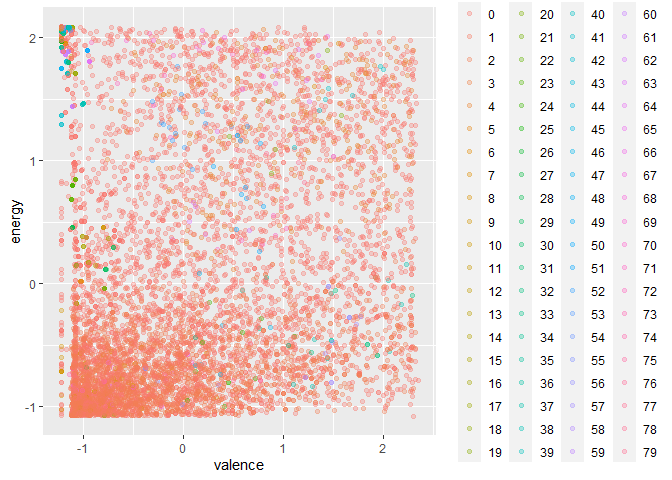<!-- -->

### 3.2 Análisis de claustering: Fuzzy C Means

Se usará este algoritmo para contrastar con la información antes
obtenida.

``` r
modelo_c_means <- cmeans(escal_data,  79, m=2)

ggplot(escal_data, aes(valence, energy, color = factor(modelo_c_means$cluster))) + 
  geom_point(alpha = 0.3) 
```

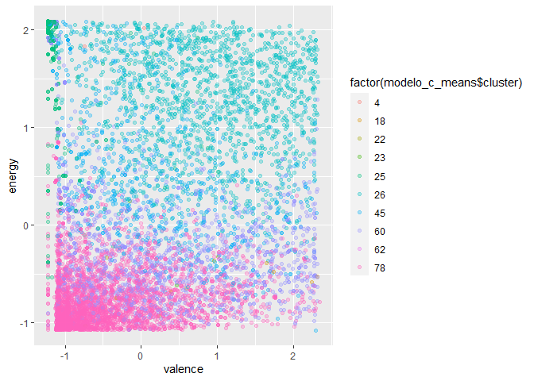<!-- -->

Luego, todo se ve muy difuso, sin exisitr claridad en los grupos.

Para saber qué tan efectivo es lo aplicado anteriormente se calculará el
Coeficiente de partición difusa (FPC)

``` r
matriz <- modelo_c_means$membership%*%t(modelo_c_means$membership)

(FPC <- sum(matriz*diag(nrow(matriz)))/nrow(matriz))
```

    ## [1] 0.01517013

Luego, se tiene que con 79 clusters existe mucha variabilidad

### 3.3 Análisis de claustering: GMM

Se analizarán los clusters a través del algoritmo GGM

``` r
model_gmm = Mclust(escal_data)

ggplot(escal_data) + 
  aes(x=valence, y=energy, color=factor(model_gmm$classification)) + 
  geom_point(alpha=1)
```

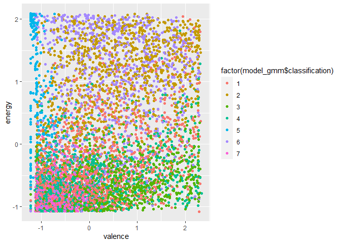<!-- -->

``` r
plot(model_gmm, what = "BIC")
```

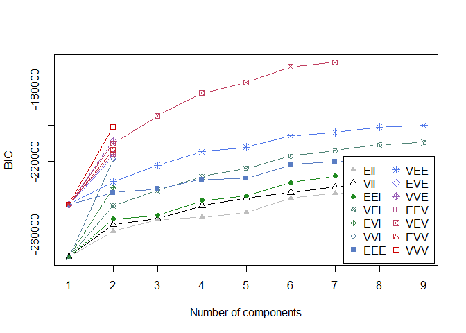<!-- -->

``` r
summary(model_gmm)
```

    ## ---------------------------------------------------- 
    ## Gaussian finite mixture model fitted by EM algorithm 
    ## ---------------------------------------------------- 
    ## 
    ## Mclust VEV (ellipsoidal, equal shape) model with 7 components: 
    ## 
    ##  log-likelihood    n  df       BIC       ICL
    ##       -80137.42 8000 570 -165397.5 -165921.2
    ## 
    ## Clustering table:
    ##    1    2    3    4    5    6    7 
    ## 1556 1151 1189 1434  759 1038  873

Se puede apreciar que el algoritmo indica que la cantidad correcta de
clusters son 9.

## 4. Segundo intento

### 4.1 Seleccionar algunas columnas de la data

``` r
dt_num1 <-c("danceability", "energy", "speechiness","acousticness","instrumentalness", "valence")

data_num1 <- spBeats %>% 
  select(dt_num1)
```

    ## Note: Using an external vector in selections is ambiguous.
    ## i Use `all_of(dt_num1)` instead of `dt_num1` to silence this message.
    ## i See <https://tidyselect.r-lib.org/reference/faq-external-vector.html>.
    ## This message is displayed once per session.

Ahora se escalará la data

``` r
escal_data1 <- sapply(data_num1, scale) %>% as.data.frame()
```

### 4.1 Análisis de claustering 2: DBSCAN

Se empieza la segunda iteración con el algoritmo DBSCAN

``` r
library(dbscan)

set.seed(369)

model1 = dbscan(escal_data1, eps = 0.5, minPts = 6)

model1
```

    ## DBSCAN clustering for 8000 objects.
    ## Parameters: eps = 0.5, minPts = 6
    ## The clustering contains 43 cluster(s) and 1421 noise points.
    ## 
    ##    0    1    2    3    4    5    6    7    8    9   10   11   12   13   14   15 
    ## 1421 6005  147    7   23   20    6    9   78    9    6    7   12    6    9    9 
    ##   16   17   18   19   20   21   22   23   24   25   26   27   28   29   30   31 
    ##   16    6   13    6   10   19    7    7    6    6    9    6    6    7    7    8 
    ##   32   33   34   35   36   37   38   39   40   41   42   43 
    ##    9   10    8    6    7    7    7   13    5    3    8    4 
    ## 
    ## Available fields: cluster, eps, minPts

Con los parametros ingresados el algoritmo arroja que son 43 clusters.
Gráficamente:

``` r
ggplot(escal_data1, aes(valence, energy, color = factor(model1$cluster))) + 
  geom_point(alpha = 0.3) 
```

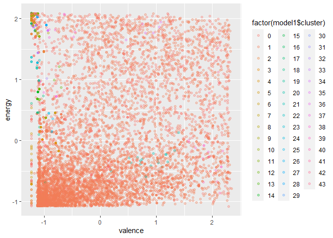<!-- -->

### 4.2 Análisis de claustering 2: Fuzzy C Means

``` r
set.seed(369)

modelo_c_means1 <- cmeans(escal_data1,  7,m=1.5) 

modelo_c_means1$membership %>% head()
```

    ##                1            2          3          4            5            6
    ## [1,] 0.003513005 0.0003405745 0.04140983 0.95060545 0.0001949372 0.0009099135
    ## [2,] 0.044343183 0.0091642865 0.02990880 0.05302279 0.0064373317 0.0053541048
    ## [3,] 0.010712394 0.0019601676 0.48033428 0.48167917 0.0010994473 0.0048506152
    ## [4,] 0.004976050 0.0003362151 0.01279960 0.97827044 0.0002362782 0.0006066842
    ## [5,] 0.113759901 0.2297885777 0.04712991 0.10530328 0.3426963034 0.1046410550
    ## [6,] 0.003258442 0.0022151555 0.01607495 0.01156306 0.0009544568 0.0020308146
    ##                7
    ## [1,] 0.003026293
    ## [2,] 0.851769501
    ## [3,] 0.019363927
    ## [4,] 0.002774737
    ## [5,] 0.056680974
    ## [6,] 0.963903115

``` r
ggplot(escal_data1, aes(valence, energy, color = factor(modelo_c_means1$cluster))) + 
  geom_point(alpha = 0.3) 
```

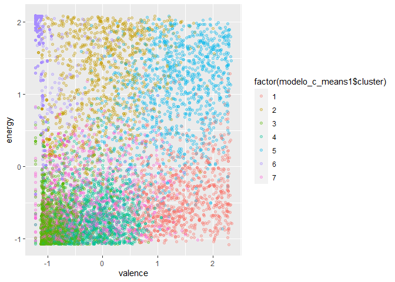<!-- -->

``` r
matriz <- modelo_c_means1$membership%*%t(modelo_c_means1$membership) # producto matricial

(FPC <- sum(matriz*diag(nrow(matriz)))/nrow(matriz))
```

    ## [1] 0.6602432

Como se puede ver, el nivel de variabilidad disminuyó bastante respecto
a la iteración anterior

### 4.3 Análisis de claustering 2: GMM

``` r
library(mclust)

set.seed(369)

model_gmm1 = Mclust(escal_data1)
```

``` r
ggplot(escal_data1) + 
  aes(x=valence, y=energy, color=factor(model_gmm1$classification)) + 
  geom_point(alpha=1)
```

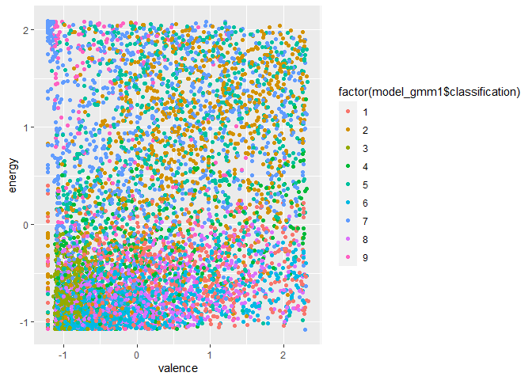<!-- -->

``` r
plot(model_gmm1, what = "BIC")
```

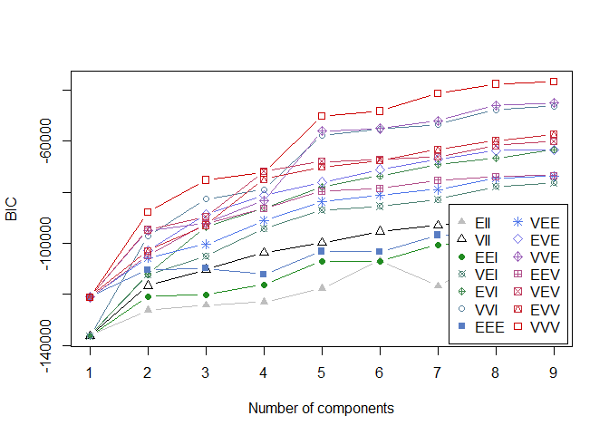<!-- -->

En este último resultado el valor de cluster es 9, pero antes dio 7. Por
lo tanto, se hará un tercer intento.

## 4. Tercer intento

### 4.1 Análisis de claustering 3: DBSCAN

Ahora en este tercer intento se cambiarán los parámetros para poder
determinar grupos más homgeneos

Iteración 1:

``` r
set.seed(369)

model1 = dbscan(escal_data1, eps = 0.5, minPts = 7)

model1
```

    ## DBSCAN clustering for 8000 objects.
    ## Parameters: eps = 0.5, minPts = 7
    ## The clustering contains 31 cluster(s) and 1583 noise points.
    ## 
    ##    0    1    2    3    4    5    6    7    8    9   10   11   12   13   14   15 
    ## 1583 5921  147    7   23   20    9   78    9    7   12    9    9   16   13   10 
    ##   16   17   18   19   20   21   22   23   24   25   26   27   28   29   30   31 
    ##    7    7    9    7    7    8   19    9   10    8    7    7    7    7    4    4 
    ## 
    ## Available fields: cluster, eps, minPts

``` r
ggplot(escal_data1, aes(valence, energy, color = factor(model1$cluster))) + 
  geom_point(alpha = 0.3) 
```

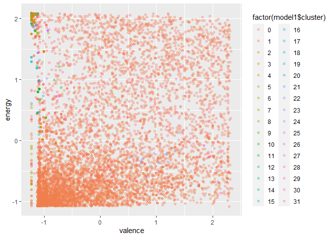<!-- --> Iteración 2:

``` r
set.seed(369)

model1 = dbscan(escal_data1, eps = 0.5, minPts = 8)

model1
```

    ## DBSCAN clustering for 8000 objects.
    ## Parameters: eps = 0.5, minPts = 8
    ## The clustering contains 21 cluster(s) and 1747 noise points.
    ## 
    ##    0    1    2    3    4    5    6    7    8    9   10   11   12   13   14   15 
    ## 1747 5827  147   23   19    9   78    9   12    9    9   16   13   10    9    8 
    ##   16   17   18   19   20   21 
    ##   18    9   10    8    5    5 
    ## 
    ## Available fields: cluster, eps, minPts

``` r
ggplot(escal_data1, aes(valence, energy, color = factor(model1$cluster))) + 
  geom_point(alpha = 0.3) 
```

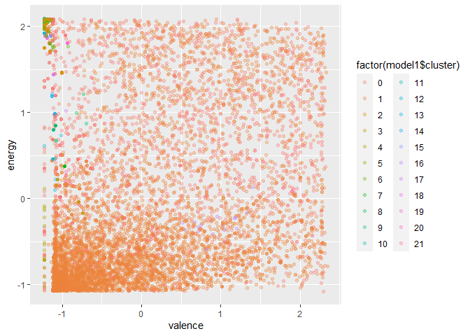<!-- --> Iteración 3:

``` r
set.seed(369)

model1 = dbscan(escal_data1, eps = 0.5, minPts = 9)

model1
```

    ## DBSCAN clustering for 8000 objects.
    ## Parameters: eps = 0.5, minPts = 9
    ## The clustering contains 22 cluster(s) and 1855 noise points.
    ## 
    ##    0    1    2    3    4    5    6    7    8    9   10   11   12   13   14   15 
    ## 1855 5708  147   23   19    9   78    9   12    9    9   16   13   10   10    7 
    ##   16   17   18   19   20   21   22 
    ##   13    9   14    9   10    7    4 
    ## 
    ## Available fields: cluster, eps, minPts

``` r
ggplot(escal_data1, aes(valence, energy, color = factor(model1$cluster))) + 
  geom_point(alpha = 0.3) 
```

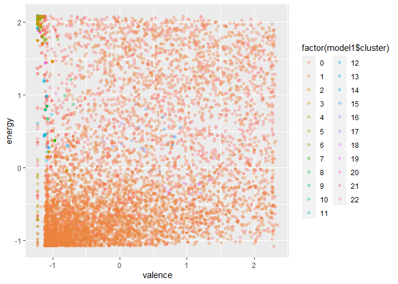<!-- --> Iteración 4:

``` r
set.seed(369)

model1 = dbscan(escal_data1, eps = 0.5, minPts = 10)

model1
```

    ## DBSCAN clustering for 8000 objects.
    ## Parameters: eps = 0.5, minPts = 10
    ## The clustering contains 13 cluster(s) and 2007 noise points.
    ## 
    ##    0    1    2    3    4    5    6    7    8    9   10   11   12   13 
    ## 2007 5638  147   21   19   75   12   16   13   10   14   10   10    8 
    ## 
    ## Available fields: cluster, eps, minPts

``` r
ggplot(escal_data1, aes(valence, energy, color = factor(model1$cluster))) + 
  geom_point(alpha = 0.3) 
```

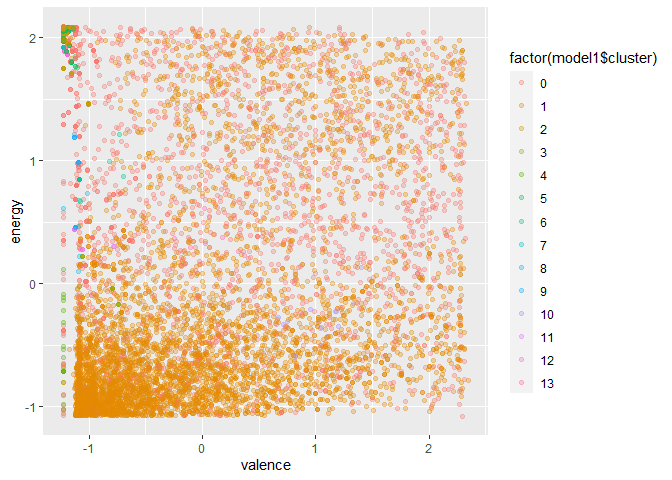<!-- -->

Iteración 5:

``` r
set.seed(369)

model1 = dbscan(escal_data1, eps = 0.6, minPts = 10)

model1
```

    ## DBSCAN clustering for 8000 objects.
    ## Parameters: eps = 0.6, minPts = 10
    ## The clustering contains 9 cluster(s) and 1233 noise points.
    ## 
    ##    0    1    2    3    4    5    6    7    8    9 
    ## 1233 6301  275   26   89   30   16   10   10   10 
    ## 
    ## Available fields: cluster, eps, minPts

``` r
ggplot(escal_data1, aes(valence, energy, color = factor(model1$cluster))) + 
  geom_point(alpha = 0.3) 
```

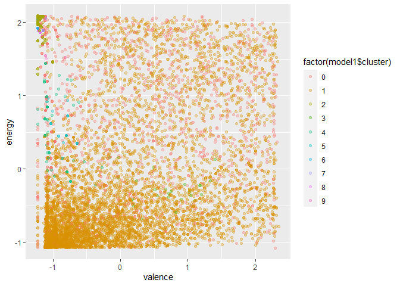<!-- -->

Iteración 6:

``` r
set.seed(369)

model1 = dbscan(escal_data1, eps = 0.7, minPts = 10)

model1
```

    ## DBSCAN clustering for 8000 objects.
    ## Parameters: eps = 0.7, minPts = 10
    ## The clustering contains 8 cluster(s) and 794 noise points.
    ## 
    ##    0    1    2    3    4    5    6    7    8 
    ##  794 7098   27   23   14   10    8   10   16 
    ## 
    ## Available fields: cluster, eps, minPts

``` r
ggplot(escal_data1, aes(valence, energy, color = factor(model1$cluster))) + 
  geom_point(alpha = 0.3) 
```

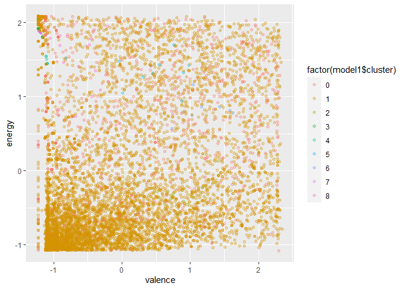<!-- -->

Pareciera que a medida que la cantidad de cluster disminuye, más
homogeneo se ven los grupos. Para confirmar esto se continuará con los
siguiente métodos.

### 4.1 Análisis de claustering 3: Fuzzy C Mean

Se iterará al igual que antes:

Iteración 1:

``` r
set.seed(369)

modelo_c_means1 <- cmeans(escal_data1,  6,m=1.5) 

modelo_c_means1$membership %>% head()
```

    ##                1            2          3          4           5            6
    ## [1,] 0.003703893 0.0002572368 0.05091787 0.94091342 0.003461406 0.0007461704
    ## [2,] 0.050372420 0.0077977483 0.03329139 0.05964226 0.841040601 0.0078555831
    ## [3,] 0.010885677 0.0013691143 0.52614700 0.43743474 0.020233676 0.0039297986
    ## [4,] 0.005789366 0.0003244819 0.01656549 0.97320733 0.003481241 0.0006320979
    ## [5,] 0.144982736 0.4304645480 0.05756247 0.12917756 0.072484145 0.1653285380
    ## [6,] 0.005015494 0.0017645023 0.02471530 0.01739864 0.947240193 0.0038658676

``` r
ggplot(escal_data1, aes(valence, energy, color = factor(modelo_c_means1$cluster))) + 
  geom_point(alpha = 0.3) 
```

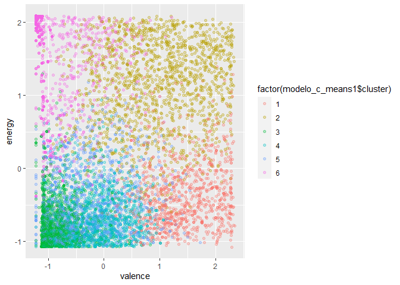<!-- -->

``` r
matriz <- modelo_c_means1$membership%*%t(modelo_c_means1$membership) # producto matricial
(FPC <- sum(matriz*diag(nrow(matriz)))/nrow(matriz))
```

    ## [1] 0.6652259

Iteración 2:

``` r
set.seed(369)

modelo_c_means1 <- cmeans(escal_data1,  5,m=1.5) 

modelo_c_means1$membership %>% head()
```

    ##                1           2          3          4           5
    ## [1,] 0.046315103 0.001309343 0.93013736 0.01820089 0.004037301
    ## [2,] 0.058642719 0.008098471 0.03987454 0.88541939 0.007964871
    ## [3,] 0.016517879 0.001053071 0.96358881 0.01564951 0.003190734
    ## [4,] 0.248337738 0.005337538 0.67593293 0.05955426 0.010837542
    ## [5,] 0.166935610 0.487623888 0.07831255 0.08462028 0.182507669
    ## [6,] 0.008612761 0.002291653 0.03128896 0.95281191 0.004994713

``` r
ggplot(escal_data1, aes(valence, energy, color = factor(modelo_c_means1$cluster))) + 
  geom_point(alpha = 0.3) 
```

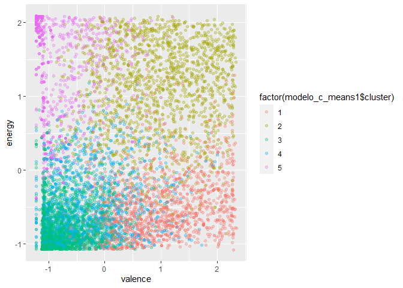<!-- -->

``` r
matriz <- modelo_c_means1$membership%*%t(modelo_c_means1$membership) # producto matricial
(FPC <- sum(matriz*diag(nrow(matriz)))/nrow(matriz))
```

    ## [1] 0.7167359

Iteración 3:

``` r
set.seed(369)

modelo_c_means1 <- cmeans(escal_data1,  4,m=1.5) 

modelo_c_means1$membership %>% head()
```

    ##               1           2          3          4
    ## [1,] 0.05216290 0.001530112 0.92863455 0.01767243
    ## [2,] 0.17602225 0.022665612 0.10445442 0.69685772
    ## [3,] 0.02356313 0.001618981 0.95612409 0.01869379
    ## [4,] 0.29265799 0.006393982 0.64616249 0.05478554
    ## [5,] 0.20856485 0.579096454 0.09554083 0.11679787
    ## [6,] 0.02787315 0.007573041 0.09035259 0.87420122

``` r
ggplot(escal_data1, aes(valence, energy, color = factor(modelo_c_means1$cluster))) + 
  geom_point(alpha = 0.3) 
```

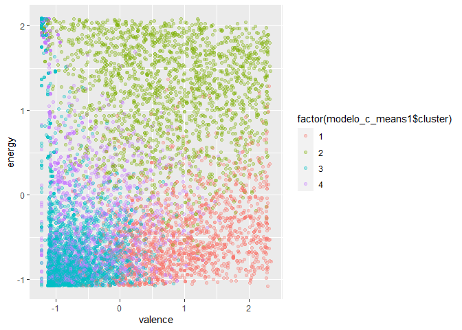<!-- -->

``` r
matriz <- modelo_c_means1$membership%*%t(modelo_c_means1$membership) # producto matricial
(FPC <- sum(matriz*diag(nrow(matriz)))/nrow(matriz))
```

    ## [1] 0.7090486

Al observar este último resultado, se tiene que con 5 clusters hay menos
variabilidad que con 4 o que con 6, por que este sería un punto de
inflexión. Ahora se continuará iterando, pero los cambios se realizarán
en el segundo parámetro.

Iteración 4

``` r
set.seed(369)

modelo_c_means1 <- cmeans(escal_data1,  5,m=1.4) 

modelo_c_means1$membership %>% head()
```

    ##                1            2          3           4           5
    ## [1,] 0.019687267 0.0002581833 0.97264584 0.006377338 0.001031367
    ## [2,] 0.030761148 0.0026711859 0.01932122 0.944820362 0.002426089
    ## [3,] 0.005589336 0.0001955970 0.98813617 0.005308161 0.000770736
    ## [4,] 0.193860756 0.0017735798 0.76664271 0.033571104 0.004151854
    ## [5,] 0.148015917 0.5782375913 0.05790130 0.062811390 0.153033805
    ## [6,] 0.002639559 0.0005330668 0.01352691 0.981973620 0.001326841

``` r
ggplot(escal_data1, aes(valence, energy, color = factor(modelo_c_means1$cluster))) + 
  geom_point(alpha = 0.3) 
```

<!-- -->

``` r
matriz <- modelo_c_means1$membership%*%t(modelo_c_means1$membership) # producto matricial
(FPC <- sum(matriz*diag(nrow(matriz)))/nrow(matriz))
```

    ## [1] 0.7845166

Iteración 5:

``` r
set.seed(369)

modelo_c_means1 <- cmeans(escal_data1,  5,m=1.3) 

modelo_c_means1$membership %>% head()
```

    ##                 1            2           3            4            5
    ## [1,] 0.0046857430 1.649524e-05 0.994124481 0.0010744407 9.884027e-05
    ## [2,] 0.0098518193 3.900723e-04 0.005312853 0.9841243828 3.208724e-04
    ## [3,] 0.0009092411 1.142914e-05 0.998155132 0.0008558597 6.833810e-05
    ## [4,] 0.1222959502 2.610650e-04 0.864665919 0.0120098528 7.672132e-04
    ## [5,] 0.1116443544 7.136364e-01 0.032262369 0.0351606035 1.072962e-01
    ## [6,] 0.0003542961 4.437242e-05 0.003147972 0.9963118340 1.415251e-04

``` r
ggplot(escal_data1, aes(valence, energy, color = factor(modelo_c_means1$cluster))) + 
  geom_point(alpha = 0.3) 
```

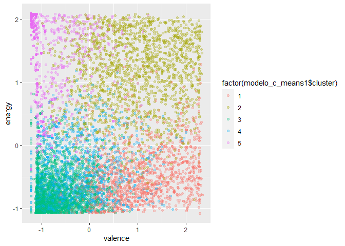<!-- -->

``` r
matriz <- modelo_c_means1$membership%*%t(modelo_c_means1$membership) # producto matricial
(FPC <- sum(matriz*diag(nrow(matriz)))/nrow(matriz))
```

    ## [1] 0.8481856

Iteración 6:

``` r
set.seed(369)

modelo_c_means1 <- cmeans(escal_data1,  5,m=1.2) 

modelo_c_means1$membership %>% head()
```

    ##                 1            2            3            4            5
    ## [1,] 4.480799e-04 1.238108e-07 0.9995071896 4.460627e-05 5.007814e-10
    ## [2,] 2.397822e-02 1.396448e-04 0.0045712916 9.713104e-01 4.008780e-07
    ## [3,] 1.241548e-04 2.261963e-07 0.9997805182 9.509838e-05 2.471110e-09
    ## [4,] 1.127841e-01 1.311767e-05 0.8850711020 2.131624e-03 8.149939e-08
    ## [5,] 5.188614e-02 9.272990e-01 0.0100602678 1.061929e-02 1.352886e-04
    ## [6,] 4.614214e-05 2.156798e-06 0.0007189385 9.992327e-01 1.263141e-08

``` r
ggplot(escal_data1, aes(valence, energy, color = factor(modelo_c_means1$cluster))) + 
  geom_point(alpha = 0.3) 
```

<!-- -->

``` r
matriz <- modelo_c_means1$membership%*%t(modelo_c_means1$membership) # producto matricial
(FPC <- sum(matriz*diag(nrow(matriz)))/nrow(matriz))
```

    ## [1] 0.8980144

Iteración 7:

``` r
set.seed(369)

modelo_c_means1 <- cmeans(escal_data1,  5,m=1.1) 

modelo_c_means1$membership %>% head()
```

    ##                 1            2            3            4            5
    ## [1,] 6.936163e-07 4.756918e-14 9.999993e-01 3.951498e-09 9.288623e-19
    ## [2,] 8.017576e-05 3.180794e-09 2.186523e-06 9.999176e-01 3.088515e-14
    ## [3,] 1.007844e-07 3.013392e-13 9.999999e-01 4.192164e-08 4.210062e-17
    ## [4,] 5.354891e-02 5.901368e-10 9.464377e-01 1.338963e-05 2.715532e-14
    ## [5,] 3.056979e-03 9.966906e-01 1.556888e-04 9.673669e-05 2.748529e-08
    ## [6,] 2.074794e-10 5.082035e-13 3.881298e-08 1.000000e+00 2.020882e-17

``` r
ggplot(escal_data1, aes(valence, energy, color = factor(modelo_c_means1$cluster))) + 
  geom_point(alpha = 0.3) 
```

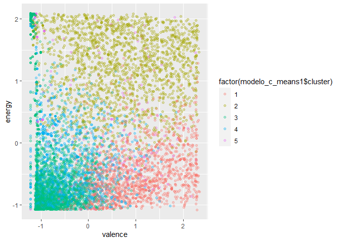<!-- -->

``` r
matriz <- modelo_c_means1$membership%*%t(modelo_c_means1$membership) # producto matricial
(FPC <- sum(matriz*diag(nrow(matriz)))/nrow(matriz))
```

    ## [1] 0.9553445

Iteración 7:

``` r
set.seed(369)

modelo_c_means1 <- cmeans(escal_data1,  5,m=0.9) 

modelo_c_means1$membership %>% head()
```

    ##                 1            2         3            4          5
    ## [1,] 1.427619e-14 1.423530e-14 0.9560445 2.583634e-20 0.04395545
    ## [2,] 9.337094e-12 9.360286e-12 0.9707570 1.015787e-10 0.02924300
    ## [3,] 6.718309e-12 6.700779e-12 0.9377001 3.951024e-17 0.06229988
    ## [4,] 3.862196e-13 3.862805e-13 0.9570696 8.416181e-16 0.04293045
    ## [5,] 5.520369e-07 5.528096e-07 0.9841883 4.049316e-05 0.01577015
    ## [6,] 2.456108e-11 2.452135e-11 0.9610352 9.206533e-12 0.03896482

``` r
ggplot(escal_data1, aes(valence, energy, color = factor(modelo_c_means1$cluster))) + 
  geom_point(alpha = 0.3) 
```

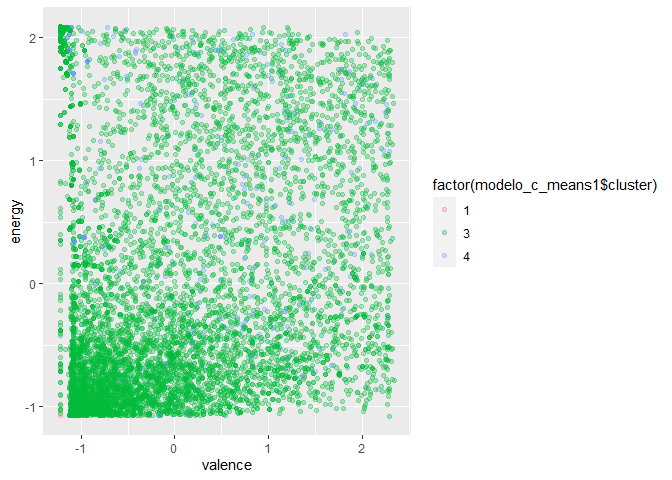<!-- -->

``` r
matriz <- modelo_c_means1$membership%*%t(modelo_c_means1$membership) # producto matricial
(FPC <- sum(matriz*diag(nrow(matriz)))/nrow(matriz))
```

    ## [1] 0.9200165

Al poner como segundo parametro 1.0 el resultado es nulo, pero al pasar
a 0.9 sí entrega un resultado que es menor a al valor encontrado con
1,1. Luego, bajo los parámetros de 5 cluster y 1.1, la variabilidad es
muy baja, por lo que se estaría en presencia de un óptimo.

Luego, dado que sí es capaz de que visualmente sí es posible ver los
grupos y considerando la baja variabilidad, entonces el número de
cluster correcto es 5.
